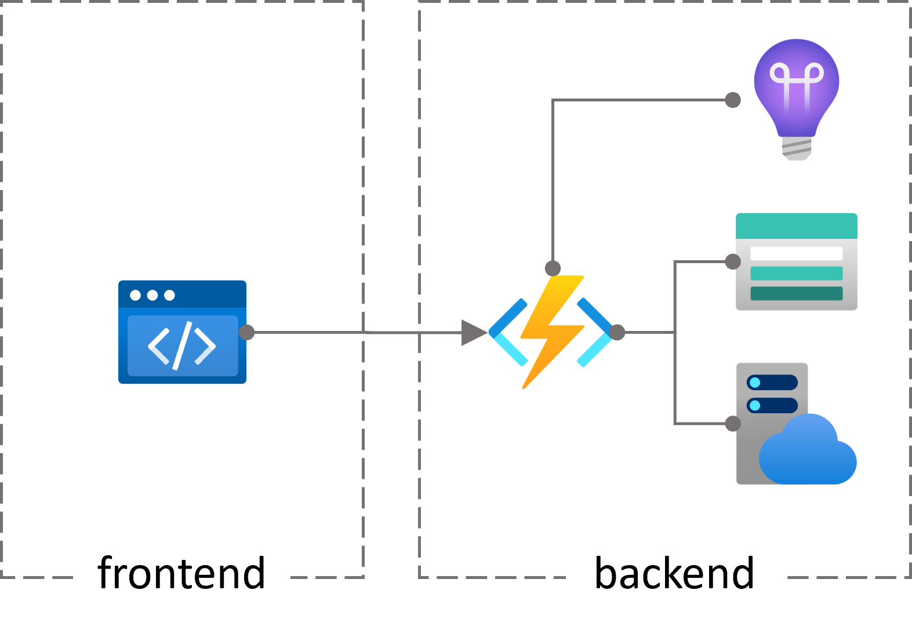
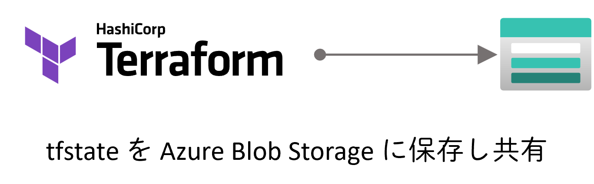

# Infrastructure

## 構成

### Azure リソース構成

### Terraform 構成

## 管理

Terraform の実行環境の初期構成は、[./initialize](./initialize) を参照してください。

Terraform による Azure リソース管理は、[./terraform](./terraform) を参照してください。
